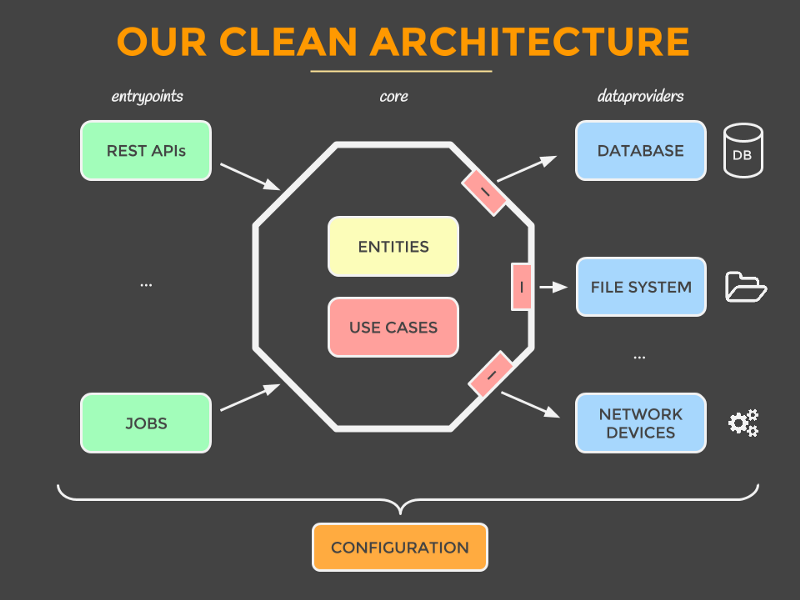
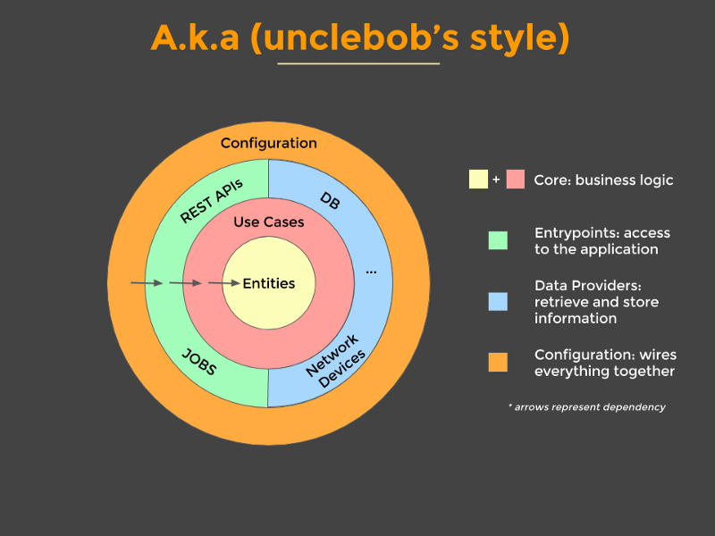
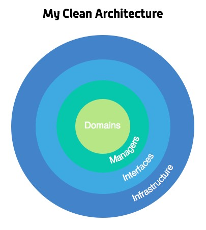
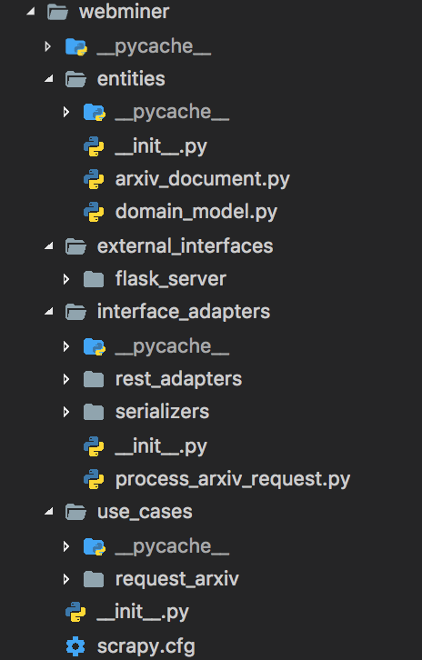

# [معرفی سریع معماری تمیز](https://github.com/Createdd/Writing/blob/master/2018/articles/CleanA.md)

###### by Daniel Deutsch

در یک پروژه اپن سورس شروع به همکاری کردم ، که در آن معماری تمیز آورده شده بود.

ابتداً ، بسیار غافلگیرانه بود ، اما بعد از کمی مطالعه اونو درک کردم ، من فکر کردم میتونه کمکی باشه به دیگران اگر افکارم رو بنویسم.

## فهرست مطالب

- [ارائه بصری](#%d8%a7%d8%b1%d8%a7%d8%a6%d9%87-%d8%a8%d8%b5%d8%b1%db%8c)

- [مفهوم](#%d9%85%d9%81%d9%87%d9%88%d9%85)

- [نمونه کد](#%d9%86%d9%85%d9%88%d9%86%d9%87-%da%a9%d8%af)

- [منابع](#%d9%85%d9%86%d8%a7%d8%a8%d8%b9)

---

## ارائه بصری

من فکر میکنم همیشه خوبه که شروع کنیم با کمی تصویر.  
در اینجا عمومی ترین تصویر از این مفهم آورده شده.  

  
  
  
  

---

## مفهوم

توسعه داده شده از : [Mattia Battiston, under CC BY 4.0](https://github.com/mattia-battiston/clean-architecture-example)

### ارزش ها

- استراتژی تست موثر که پیرو هرم تست هست
- چهارچوب های کاری محصور میشن در ماژول های منحصر به فرد بنابراین وقتی که ما نظرمون عوض میشه ما تنها باید یک محل رو تغییر بدیم ، بقیه برنامه نمیدونن حتی یوزکیس ها گره خوردن با سیستم کراد (CRUD)
- معماری فریاد ، فریاد میزنه مصرف های خودش رو ، وقتی شما نگاه می‌اندازین به ساختار پکیج شما درک می‌کنین برنامه چه کاری انجام می ده به جای اینکه نگاه بندازین به جزئیات فنی اون
- تمام منطق تجاری برنامه درون یک یوزکیس هست پس جستجو در آن آسون میشه و تکراری در هیجا نیست
- انجام اشتباهات سخت میشه چون ماژول ها اجبار میکنن به کامپایل وابستگی ها ، اگر شما سعی کنید استفاده کنین از چیزی که شما قصدش رو نداشتین برنامه کامپایل نمیشه
- اون همیشه آماده پیاده سازی هست با متصل نکردن اشیا به هم تا آخر یا با استفاده از ویژگی ها ، پس ما داریم همه مزایای continuous integration
- چندین کار روی یک موضوع به طور همزمان کار میکنن به راحتی تا موضوع سریعتر تموم بشه
- یکپارچگی خوب با یوزکیس های تمیز که میتونین بعداً هر کدوم رو به یک میکروسرویس تبدیل کنین هنگامی که در مورد میکروسرویس ها بیشتر آموختید

### موجودیت ها

- نمایش میدن اشیا دامنه کاری شما رو
- اعمال منطقی که کاربردی هست به طور عمومی در کل موجودیت (به طور مثال اعتبارسنجی قالببندی نام یک هاست)
- شی ساده ، نه چهارچوبی نه حاشیه نویسی ای (annotation)

### یوزکیس ها

- نمایش میده رفتار های کار شما رو ، اونها شامل چیزهایی هست که شما میتونید با برنامه انجام بدید ، انتظار میره که فقط برای هر رفتار در کار شما یک یوزکیس موجود باشه
- منطق کار خالص ، کد ساده (انتظار میره کهشاید مقداری ابزار کاربردی باشه)
- یوزکیس ها نمیدونن چطور راه اندازی میشن و چطور نتیجه میره برای نمایش (میتونه در صفحه وب باشه یا برگردونه یک json یا به سادگی لاگ بشه یا ...)
- خطاهای کاری رو برمی گردونه

### رابط ها - مبدل ها

- ذخیره و بازیابی داده از یا به چندین منبع داده (مثل پایگاه داده ، دستگاه های شبکه ، سیتم فایل ، شخص ثالث همکار یا ...)
- تعریف رابط ها برای داده هایی که نیاز دارن که برخی از منطق ها روشون اعمال بشه ، یک یا چند تامین کننده داده پیاده سازی میکنن رابط ها رو ، اما یوزکیس ها نمیدونن که داده ها از کجا اومدن
- پیاده سازی رابط ها تعریف میشن توسط یوزکیس ها
- راه هایی هستن برای تعامل با برنامه ، و معمولا درگیرن با یک مکانیسم دریافت (مثل کار های زمانبندی شده ، رابط کاربری ، REST APIs ، دیگر سیستم ها)
- راه اندازی میکنن یک یوزکیس رو و تبدیل میکنن نتیجه رو به قالب مناسب برای ساز و کار های دریافت
- مثل یک کنترلر برای معماری MVC

### رابط های خارجی

چهارچوبی که بیشتر مناسب هست رو استفاده میکنن (اونا میرن که محصور بشن در اینجا به هر حال)

---

## نمونه کد

ببینید ساختار رو در [گیتهاب](https://github.com/Createdd/web-miner/tree/master/webminer)

اول از همه ، چیزی که مهمه که فهمید اینه که معماری تمیز هست یک بسته یا مجموعه از اصول سازماندهی ، بنابراین همه چیز باز هست برای شخصی سازی تا وقتی که هسته یا اصل ایده ها حفظ بشه ، مخزن مرتبط هست یک انشعاب از پروژه اصلی که برای من آورد ایده این طراحی معماری رو ، راحت باش
بررسی کن پروژه اصلی رو به خوبی ، زیرا این بازتاب پیشرفتهای بعدی و بیشتر است

پوشه webminer هست ساختاریافته به پوشه های اصلی زیر:  
   1. entities
   2. use_cases
   3. interfaces_adapters
   4. external_interfaces

اون باید بازتاب کنه روشی بسیار اساسی برای الگوی طراحی.
* شروع میکنیم از entities شما میتونید ببینید که در هسته مدل این پروژه arxiv_document قرار داره
* پوشه بعد ، use_cases نشون میده یوزکیس ما رو ، به نام درخواست صفحه arxiv 
* بعد از اون میر یم سراغ پوشه interfaces_adapters اون فراهم میکنه مبدل های  پردازش درخواست ها در یک برنامه REST یا برای سریال کردن داده
* آخرین لایه هست external_interfaces که ما استفاده میکنیم از سرور flask و پیاده میکنیم عملکرد REST رو

همه ی این لایه ها به لایه هسته وابسته هستن اما نه برعکس  

یک نکته مهم: در این منبع پیاده سازی کاملاً و صددرصد درست نیست

چرا؟ چون یوزکیس ها واقعاً یه جور دیگه هستن ، در واقعیت یوزکیس اصلی فراهم میکنه داده ساخت یافته رو و دیگر یوزکیس ها داده رو میگیرن از صفحه arxiv ، این خطا رو کشف کردین در معماری؟ اگر بله تبریک میگم بهتون ، نه تنها شما به اندازه کافی در مقاله کنجکاو بودین اما شما همچنین به نظر می رسه که درک کردین اصول رو به طور کافی برای ساخت پروژه خودتون و اعمال مفاهیم به واقع ، ادامه بدین!

موافقید؟ اگر نه ، چرا؟  
ممنونم برای خوندن مقاله من! راحت باشید و هر بازخوردی رو بفرستید!

---

## منابع
اینجا داریم برخی از مقاله های رو که میتونه کمک کنه برای درک مفهوم "معماری تمیز":  

- https://8thlight.com/blog/uncle-bob/2012/08/13/the-clean-architecture.html
- https://www.codingblocks.net/podcast/clean-architecture-make-your-architecture-scream/
- https://github.com/mattia-battiston/clean-architecture-example
- https://medium.com/@tiagoflores_23976/how-choose-the-appropriate-ios-architecture-mvc-mvp-mvvm-viper-or-clean-architecture-2d1e9b87d48
- https://de.slideshare.net/HimanshuDudhat1/mvp-clean-architecture
- https://softwareengineering.stackexchange.com/questions/336677/what-is-the-difference-between-mvp-and-clean-architecture
- https://engineering.21buttons.com/clean-architecture-in-django-d326a4ab86a9
- https://gist.github.com/ygrenzinger/14812a56b9221c9feca0b3621518635b
- https://medium.freecodecamp.org/how-to-write-robust-apps-consistently-with-the-clean-architecture-9bdca93e17b
- https://marconijr.com/posts/clean-architecture-practice/

---

