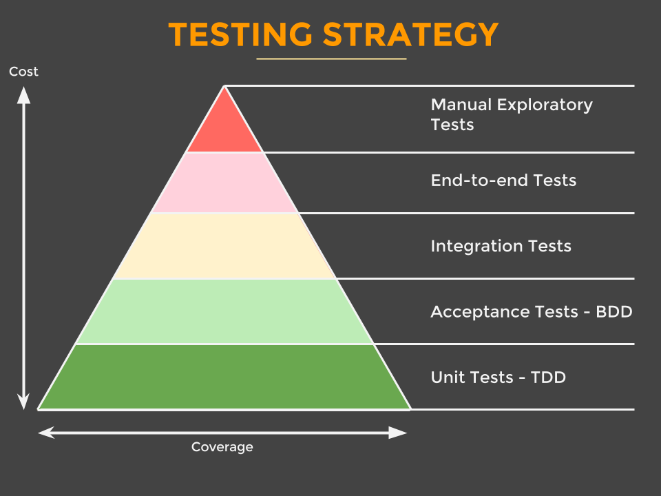

# [مثال معماری تمیز](https://github.com/mattia-battiston/clean-architecture-example)

###### by mattia battiston

این هست یک نمونه پروژه برای اینکه نشون بده معماری تمیز چیه و چه شکلی هست

این در اصل ساخته شده تا با هم باشن با [این ارائه](http://www.slideshare.net/mattiabattiston/real-life-clean-architecture-61242830)

## لیست مطالب
* [چرا معماری تمیز؟](#%da%86%d8%b1%d8%a7-%d9%85%d8%b9%d9%85%d8%a7%d8%b1%db%8c-%d8%aa%d9%85%db%8c%d8%b2%d8%9f)
* [ساختار برنامه](#%d8%b3%d8%a7%d8%ae%d8%aa%d8%a7%d8%b1-%d8%a8%d8%b1%d9%86%d8%a7%d9%85%d9%87)
* [استراتژی تست](#%d8%a7%d8%b3%d8%aa%d8%b1%d8%a7%d8%aa%da%98%db%8c-%d8%aa%d8%b3%d8%aa)
* [ساخت و اجرای برنامه](#%d8%b3%d8%a7%d8%ae%d8%aa-%d9%88-%d8%b1%d8%a7%d9%87-%d8%a7%d9%86%d8%af%d8%a7%d8%b2%db%8c-%d8%a8%d8%b1%d9%86%d8%a7%d9%85%d9%87)
* [دامنه مثال](#%d8%af%d8%a7%d9%85%d9%86%d9%87-%d9%85%d8%ab%d8%a7%d9%84)
* [منابع](#%d9%85%d9%86%d8%a7%d8%a8%d8%b9)

## چرا معماری تمیز؟
> مرکز برنامه شما پایگاه داده نیست. یک یا چند چهارچوب کاری که ممکنه ازش استفاده کنید هم نیست. مرکز برنامه شما یوزکیس های برنامه شما است - عمو باب ([منبع](https://blog.8thlight.com/uncle-bob/2012/05/15/NODB.html))

معماری تمیز کمکون میکنه تا حل کنیم ، یا به حداقل کاهش بدیم ، این مشکلات متداول با معماری برنامه رو:
* **تصمیماتی که زود گرفته شدن** ، اغلب در شروع یک پروژه ، وقتی شما در مورد مشکلات کم میدونید میخواید حلشون کنید
* **تغییرات سختن** ، پس وقتی ما درمیابیم نیاز های جدید رو ما باید تصمیم بگیریم که هکش  کنیم اونو بریم جلو (غیر اصولی انجامش بدیم) یا راه خیلی هزینه بر و دردناکه طراحی دوباره رو انتخاب کنیم ، همیشه هممون میدونیم کدوم برنده میشه ، بهترین معماری ها اونایی هستن که این امکان رو به ما میدن التزاممون رو به تعویق بندازن یک راه حل خاص و اجازه بدن به ما اجازه تغییر نظر رو بده
* **محوریت با چهارچوب** ، چهارچوب ها ابزار هستن برای استفاده ما ، نه معماری برای اینکه ما مطابقش رفتار کنیم ، چهارچوب ها اغلب به التزام شما نیاز دارن ، اما اونا برای شما سر سپرده نمیشن ، اونا میتونن رشد کنن در جهات مختلف رشد کنن ، و آنگاه شما گیر میکنید بین دنبال کردن قوانین اونا و تغییراتتون
* **محوریت با پایگاه داده** ما اغلب ابتدا در مورد پایگاه داده فکر میکنیم و بعد ساختن سیستم کراد در اطراف آن. ما در نهایت استفاده میکنیم اشیا پایگاه داده رو در همه جا و رفتار میکنیم با همه چیز در قوانین جداول و سطر ها و ستون ها
* **تمرکز ما روی جنبه های تکنیکی** و وقتی ازمون میپرسن در مورد معماریمون ما میگیم چیزی شبیه به این: اون هست سرولت اجرا شده روی سرور تامکت با پایگاه داده اوراکل با استفاده از اسپرینگ
* **سخته پیدا کردن چیزها** که همه تغییرات رو طولاتی تر و دردناکتر میکنه
* **منطق کاری همه جا پخش شده** ، پراکنده بین چندین لایه ، پس وقتی میخوایم بررسی کنیم که یک چیز چطوری کار میکنه تنها گزینه ما اینه که دیباگ کنیم کل پایگاه کدمون رو ، حتی بدتر ، اغلب اونها در چندین جا تکرار شدن
* **اجبار یا تشویق آهسته به تست های سنگین** اغلب تنها انتخاب ما برای تست ، رابط کاربری است ، یا چون رابط کاربری داره مقدار زیادی از منطق برنامه رو ، یا چون معماری اجازه نمیده کار دیگه ای انجام بدیم ، این کند میکنه اجرای تست ها رو ، سنگین و شکننده. اون نتیجه اش این میشه که افراد اجراشون نکنن و یا اغلب ناقص بسازنشون
* **استقرار های کم** چون اون ها سخته انجام تغییرات بدون شکستن قابلیتها ی موجود. افراد متوسل میشن به شاخه های ویژگی با طول عمر بالا که باعث میشه یکپارچه سازی را تا آخر به تاخیر بندازن و نتیجتاً انتشار های بزرگ رو باعث میشه ، بجای موارد کوچک

**معماری تمیز این مزایا رو به ما میده:**
* **استراتژی موثر تست** که دنبال میکنه هرم تست رو و به ما سرعت و انعطاف رو در بیلد ها میده
* **چهارچوب ها محصور هستن** در ماژول های متعدد ، پس وقتی تغییر میکنه نظرمون ما فقط باید تغییر بدیم یک محل رو ،  در صورتی که باقی برنامه نمیدونن حتی نمیدونن در موردش
* **مستقل از پایگاه داده** ، که با اون مثل بقیه ارائه دهنده های داده رفتار میشه. برنامه ما در واقع یوزکیس هایی که بیشتر بیشتر از اینن که یک سیستم کراد باشن
* **معماری فریاد** اون داد میزنه استفاده تعریف شده خودش رو. وقتی شما نگاه میکنید به ساختار پکیج ها درکش میکنید که برنامه چه کاری میکنه بیشتر از اونکه ببینید جزئیات فنی اش رو
* **همه منطق کاری در یوزکیس ها هستن** پس راحت پیدا کردن و تکرار هیچ جا نیست دیگه
* **دشوار بودن انجام اشتباهات** چون ماژول ها اجبار میکنن وابستگی های کامپایل را. اگر شما سعی کنید  که استفاده کنین چیزیو که نیاز ندارید بهش ، برنامه کامپایل نمیشه
* **ما همیشه آماده استقراریم** با رها کردن اتصال اشیا به هم برای آخر یا با استفاده از ویژگیها ، پس ما داریم همه مزایای ادغام مداوم رو (نیازی به ایجاد شاخه برای ویژگی های جدید نیست)
* **هجوم به داستان ها** پس اونا به طور متفاوت با هم جفت میشن به راحتی کار میکنن روی یک داستان خاص در یک لحظه برای اتمام سریعتر اون
* **یکپارچگی خوب** با یوزکیس های تمیز و واضح ، که شما میتونید  یکیشون رو بعدا جدا کنید و به میکروسرویس تبدیل کنید ، یکبار که شما در موردش بیشتر یادگرفتید

البته ، اون با هزینه همراهه:
* **تکرار کد قابل فهم**. موجودیت ها ممکنه متفاوت نمایان بشن وقتی که استفاده میشن در منطق کاری ، وقتی تعامل میکنن با پایگاه داده ، و وقتی که ارائه اشون میدیم در قالب جیسان. شما ممکنه فکر کنید دارید کد رو تکرار میکنید ، اما شما در واقع پیروی میکنید طبق خودت رو تکرار نکن (درای) رو
* **شما به منطق کاری جالب نیاز دارید** تا توجیه کنید ساختار رو. اگر تمام چیزی که انجام میدید در یک یوزکیس با متد یک خطی هست برای خوندن یا نوشتن در یک پایکاه داده ، پس شاید شما بتونید برید با یه چیز ساده تر

## ساختار برنامه

### هسته: موجودیت ها
* نماینده اشیا دامنه کاری شمان
* اعمال میکنن فقط منطقی رو که هست کاربردی به طور عمومی در کل موجودیت (مثلاً اعتبارسنجی قالب نام یک هاست)
* اشیا ساده: نه چهارچوبی ، نه حاشیه نویسی ای

### هسته: یوزکیس ها
* نمایانگر فعالیت های کار شماست ، اونا هستن چیزایی که با برنامه میشه انجام داد ، انتظار میره که هر یوزکیس برای یک فعالیت کاری باشه
* منطق تجاری خالص ، جاوای ساده (انتظار میره شاید بعضی کتاب خونه ها مثل استرینگ یوتیلز باشه)
* تعریف رابط هایی برای داده ها که اونا نیاز دارن که روشون بعضی منطق ها اعمال بشه. یک یا چند دیتاپرووایدر (فراهم کننده داده) پیاده میکنن رابط رو ، اما یوزکیس نمیدونه که داده از کجا اومده
* یوزکیس نمیدونه کی راه اندازیش کرده و چطور نتیجه میره برای نمایش (مثلاً میتونه تو صفحه وب باشه یا برگرده به عنوان جیسان یا به سادگی لاگ بشه یا ...)
* خطاهای تجاری برمیگردونه

### دیتاپرووایدرز (فراهم کنندگان داده)
* ذخیره و بازیابی داده از و به تعدادی منبع (پایگاه داده ، دستگاه های تحت شبکه ، سیتم فایل ، همکار یا ابزار شخص ثالث یا ...)
* پیاده سازی رابط های تعریف شده توسط یوزکیس
* استفاده از چهارچوبهایی که مناسب ترن (اونا در هر حال قراره که اینجا محصور بشن)
* نکته: اگر استفاده می کنید از اوآرام برای دسترسی به پایگاه داده ، اینجا دارین مجموعه ای از دیگری از اشیا به مراتب به عنوان مپ کردن به جداول (استفاده نکنید از موجودیت های هسته چون ممکنه خیلی متفاوت باشن) 

### نقاط ورود
* راه های هستن برای تعامل با برنامه ، و معمولاً درگیر هست با یک مکانیسم دریافت (مثل ، رست ای پی آی ، کارهای برنامه ریزی شده ، رابط کاربری یا دیگر سیستم ها)
* راه اندازی یک یوزکیس و تبدیل نتیجه به قالب متناسب برای مکانیسم دریافت
* یک رابط کاربری میتونه استفاده بکنه از ام وی سی یا ام وی پی در اینجا ، کنترلر میتونن راه اندازی بکنن یوزکیس رو

### تنظیمات
* متصل کردن همه چیز با هم
* چهارچوب ها (مثلاً برای تزریق وابستگی) محصور شده اند در اینجا
* دارای -جزئیات کثیفیه- مثل مین کلس ، تنظیمات سرور ، تنظیمات منبع داده و ...

### مثال ها

## استراتژی تست

### یونیت تستز
* برای تی دی دی
* پوشش هر جز کوچک ، هدف پوشش صد در صد هست
* توسعه برای توسعه ، مستندات: آنچه باید این کلاس انجام دهد؟
* تست کلاس های مختلف محصور هستن ، خیلی سریع

### اکسپتنس تستز
* برای بی دی دی (ارتباط با ذی نفعان)
* نمایش و مستندسازی نیاز های تجارت
* تجارت ، مستند: آنچه سیستم انجام میده؟
* تست یک یوزکیس به صورت محصور ، خیلی سریع (بدون رابط کاربری ، بدون پایگاه داده یا ...)
* استفاده از چهارچوب توسعه رفتار محور مورد علاقه

### اینتگریشن تستز
* تست یکپارچه با اجزای کند ( اچ‌تی‌تی‌پی ، پایگاه داده ، ...)
* مستند توسعه: انتظار می ره کار های انجام بشن؟
* تست یک لایه در اینجا محصوره (مثل فقط پایانه رست ، یا تقلید ام‌وی‌سی ، پایگاه داده درون حافظه)

### اند تو اند تستز
* فقط قسمت های بحرانی تست میشن (شایع ترین مسیر خوشحال کننده)
* نمایش نیاز های کسب و کار نقطه به نقطه
* اجرای کل برنامه ، خیلی کند. این موارد را به حداقل برسانید

## ساخت و راه اندازی برنامه
* به اصل مقاله مراجعه شود...

## دامنه مثال
* به اصل مقاله مراجعه شود
  
## منابع

##### Presentation
* Real Life Clean Architecture http://www.slideshare.net/mattiabattiston/real-life-clean-architecture-61242830

##### Blogs & Articles
* The Clean Architecture https://blog.8thlight.com/uncle-bob/2012/08/13/the-clean-architecture.html
* Screaming Architecture http://blog.8thlight.com/uncle-bob/2011/09/30/Screaming-Architecture.html
* NODB https://blog.8thlight.com/uncle-bob/2012/05/15/NODB.html
* Hexagonal Architecture http://alistair.cockburn.us/Hexagonal+architecture

##### Videos & Presentations
* Clean Coders ep. 7: Architecture, Use Cases, and High Level Design https://cleancoders.com/episode/clean-code-episode-7/show
* Robert C. Martin - Clean Architecture https://vimeo.com/43612849
* Robert C. Martin - Clean Architecture and Design https://www.youtube.com/watch?v=Nsjsiz2A9mg

