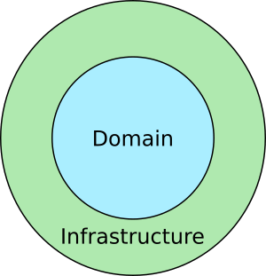
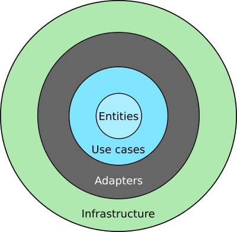
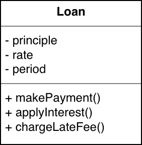
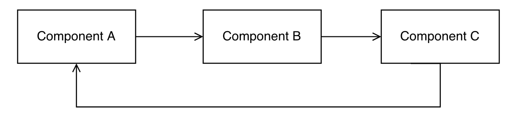

<div style="direction:rtl;">

# [معماری تمیز برای دیگران](https://pusher.com/tutorials/clean-architecture-introduction)

<div dir="ltr">

##### by Suragch

</div>

> این یک مقاله سطح مقدماتی است.

اگر شما یک استاد مهندسی نرم افزار هستید ، میتونید خوندن رو متوقف کنید. این آگهی برای شما نیست. این آگهی برای افرادی هست که شبیه من هستن ، برنامه نویسان سطح متوسط کسانی که کدهاشون کثیف و معماری اسپاگتی می سازن اما مجذوب ایده ی ساخت یه چیز تمیز ، قابل نگهداری و قابل تبدیل هستن

## پیشگفتار
من معمولا کتاب های کامپیوتر نمیخرم چون اونا سریع قدیمی میشن. از طرفی ، من میتونم پیدا کنم اطلاعات رو آنلاین در هر حال. یک سال پیش ، گرچه  ، شروع کردم خوندن کد تمیز رابرت مارتین رو. اون واقعاً توسعه نرم افزارم رو پیشرفت داد ، پس وقتی دیدم کتاب دیگه ای توسط همون نویسنده داره بیرون میاد ، که بهش میگفتن معماری تمیز ، من سریع انتخابش کردم.

شبیه کد تمیز ، معماری تمیز هست پر از اصول بی انتها که میتونه اعمال بشه و مشکلی نباشه که کسی با چه زبونی کد میزنه. اگر شما یک چستجو آنلاین بکنید برای عنوان کتاب ، پیدا میکنید افرادی رو که موافق نیستن با نویسندش. نقد کردن دیدگاه های نیست اونچه که اینجا انجام خواهم داد، بهرحال. من فقط میدونم رابرت مارتین (عمو باب) برای پنجاه ساله که داره برنامه نویسی میکنه و من نه.  

کتاب یکم دشواره برای فهمیدن ، به هر حال ، پس من بهترین کاری که میتونم انجام بدم خلاصه کردن و توضیح دادن مفاهیم مهمه در یک سطح معمولی از افراد که بتونن بفهمن. من دارم رشد میکنم به عنوان معمار نرم افزار ، پس بخونید همه چیزو من مینویسم با دید انتقادی.

## معماری تمیز چیست؟
معماری تمیز یعنی به طور کلی طراحی پروژه. اون هست سازماندهی کد ها در کلاس ها یا فایل ها یا کامپوننت ها یا ماژول ها. و نشون میده که این گروه ها از کد چطور در ارتباط هستن با دیگری. معماری تعریف میکنه کجا برنامه اجرا میشه قابلیت های هسته اش و چطور اون عملکرد ها تعامل میکنن با چیزهایی مثل پایگاه داده و رابط کاربری.

معماری تمیز اشاره داره به سازماندهی پروژه چنانکه اون فهمش راحته باشه و تغییرش راحت باشه با رشد پروژه. اون داره برنامه ریزی های عمدی.

## مشخصات یک معماری تمیز
راز ساخت یک پروژه بزرگ هست راحتی در نگهداری که هست: جداسازی فایل ها و کلاس ها در کامپوننت هایی که بتونه تغییر کنه به طور جداگانه از دیگر کامپوننت ها. بزار نشون بدم با یک جفت تصویر.

<div align="center">


</div>

در تصویر بالا ، اگر شما بخواهید جایگزین کنید قیچی رو با یک چاقو ، چطور انجام میدهید شما اونو؟ شما جدا کنید اتصال به نخ هایی که میرن به خودکار ، بطری جوهر ، نوار چسب و پرگار. آنگاه شما باید متصل کنید اون ها رو به چاقو. شاید اون کار کنه برای چاقو ، اما چطوره اگر خودکار و نوار چسب بگن ، صبر کن ما به قیچی نیاز داریم. پس حالا خودکار و نوار چسب کار نمیکنن و تغییر خواهند کرد ، که این روند تاثیر میزاره روی اشیایی که گره خوردن بهش. این یک کثیفکاریه.

مقایسه کنید با این:

<div align="center">


</div>

حالا چطور انجام میدیم جایگزینی قیچی رو؟ ما فقط داریم برداشتن نخ قیچی رو از زیر برگه های یادداشت و اضافه میکنیم یک نخ جدید که گره خورده به یک چاقو. راه ساده تر. برگه های یادداشت مهم نیست چونکه نخ بهش گره نخورده.

معماری ارائه شده بوسیله تصویر دوم مشخصاً راحته برای تغییر. تا وقتی که برگه های یادداشت نیاز به تغییر نداشته باشن غالباً ، این سیستم نگهداریش خیلی راحته. این همون مفهومیه که هست در معماری که نگهداری و تغییر نرم افزار شما رو راحت خواهد کرد.

<div align="center">



</div>

در دایره داخلی لایه ی دامنه ی برنامه شما هست. این اونجایی هست که شما قرار میدید قوانین تجاری تون رو. منظور ما از تجارت لزوما به معنی یک شرکت نیست. اون فقط به معنی عصاره آنچه برنامه انجام میده هست ، هسته عملکرد کد شما. یک برنامه ترجمه ، ترجمه میکنه. یک فروشگاه آنلاین محصول برای فروش داره. این قوانین تجاری نسبتاً پایدار هستن تار زمانی که شما دوست ندارید تغییر بدید عصاره آنچه برنامه شما انجام میده عمدتاً.

حلقه خارجی هست انفرااستراکچر (بستر). اون شامل چیزهایی هست مثل رابط کاربری ، پایگاه داده ، وب ای‌پی‌آی و چهارچوب ها. اونا چیزهایی هستن که بیشتر گرایش دارن به تغییر نسبت به دامنه. برای مثال ، شما بیشتر تمایل دارین که تغییر بدین چطور یک رابط کاربری دکمه اش که چطور باشه تا اینکه شما تغییر بدید چطور یک وام محاسبه میشه.

یک مرز هست بین دامنه و بستر که تنظیماته پس دامنه نمیدونه چیزی در مورد بستر. این یعنی رابط کاربری و پایگاه داده وابسته است به قوانین تجاری ، اما قوانین تجاری وابسته نیست به رابط کاربری یا پایگاه داده. این باعث یک معماری افزونه ای میشه. اون اهمیت نمیده اگر رابط کاربری هست یک رابط وی یا یک برنامه دسکتاپ یا یک برنامه گوشی همراه. اون اهمیت نمیده که اگر داده ذخیره بشه توسط اس‌کیو‌ال یا نو‌اس‌کیو‌ال یا در فضای ابری. دامنه توجهی نداره. این باعث راحتی در تغییر در بستر میشه.

## تعریف اصطلاحات
دو دایره در تصویر بالا میتونه بیشتر دقیق بشه.

<div align="center">



</div>

اینجا لایه دامنه تقسیم میشه به انتیتیز (موجودیتها) و یوزکیسز یا (موارد مصرف) ، و لایه آداپتر (مبدل) تشکیل میده مرز بین دامنه و لایه بستر رو. این اصطلاحات میتونن کمی گیج کننده باشن. بریم ببینیم اونا رو منحصراً.

## موجودیت ها
موجودیت هست یک مجموعه قوانین تجاری مرتبط که مهم هستن کاربردشون در برنامه. در زبان برنامه نویسی شی گرا قوانین برای موجودیت ه گروه میشن با هم به عنوان متد ها در یک کلاس. حتی اگر برنامه ای وجود نداشته باشد ، اونا میتونن موجود باشن. برای مثال ، شارژ 10 درصد بهره در یک وام هست یک قانون که یک بانک میتونه داشته باشه. این میتونه درست باشه کجا بهره محاسبه بشه روی کاغذ یا با استفاده از کامپیوتر. اینجا برای مثال از کتاب آنچه که کلاس موجودیت ممکنه باشه شبیه زیره:

<div align="center">



</div>

موجودیت هیچی نمیدونه از دیگر لایه ها. اونا وابسته نیستن به هیچی. اینه ، اونا استفاده نمی کنن از نام هیچ کلاس یا کامپوننتی که در لایه های خارجی دیگه ای هست.

## موارد مصرف
موارد مصرف هستن قوانین تجاری برای یک برنامه خاص. اونا میگن چطوریه عملکرد سیستم رو. این تعیین میکنه رفتار های یک برنامه رو. اینجا هست یک مثال از کتاب از قوانین تجاری برای یک مورد مصرف:

<div dir="ltr">

```
Gather Info for New Loan

    Input:  Name, Address, Birthdate, etc.
    Output: Same info + credit score

    Rules:
      1. Validate name
      2. Validate address, etc.
      3. Get credit score
      4. If credit score < 500 activate Denial
      5. Else create Customer (entity) and activate Loan stimation
``` 

</div>

```

جمع آوری اطلاعات برای یک وام جدید

    ورودی: نام ، آدرس ، تاریخ تولد ، غیره.
    خروجی: اطلاعات بالا + اعتبار

    قوانین:
      1. تایید نام
      2. تایید آدرس و ...
      3. دریافت اعتبار
      4. اگر اعتبار زیر 500 بود رد میشه
      5. در غیر این صورت مشتری (موجودیت) ساخته میشه و فعال میشه تخمین وام
``` 

موارد مصرف تعامل میکنن با و وابسته هستن به موجودیت ها ، اما اونا نمیدونن هیچی در مورد لایه های دیگر بیرون. اونا توجهی ندارن که اگر اون هست یک صفحه وب یا برنامه آیفون. اونا توجهی ندارن اگر داده ذخیره میشه در فضای ابری یا در یک پایگاه داده محلی اس‌کیو‌الایت.

این لایه تعریف میکنه رابط ها یا داره کلاس های انتزاعی که اونا در لایه های خارجی دیگر استفاده میشن.

## مبدل ها
مبدل ها ، همچنین خونده میشن رابط مبدل ، هستن مترجم های بین دامنه و بستر. برای مثال ، اونا میگیرن داده ورودی رو از رابط کاربری و بسته بندی مجدد میکنن اونا رو در یک قالب که مناسب هست برای موارد مصرف و موجودیت ها. آنگاه اونا میگیرن خروجی رو از موارد مصرف و موجودیت ها و دوباره بسته بندی میکنن اونا رو در قالب متاسب برای نمایش در رابط کاربری یا ذخیره در پایگاه داده.

## بستر
این لایه هست اونجایی که تمام کاموننت های ورودی و خروجی توش میرن: رابط کاربری ، پایگاه داده ، چهارچوب ها ، دستگاه ها ، و ... اون هست بی ثبات ترین لایه. از اونجا که چیز ها در این لایه خیلی تمایل به تغییر دارن ، اونا نگه داشته میشن تاجایی که میشه دورتر از لایه های دامنه ای که بیشتر پایداری دارن. اونا جدا نگهداری میشن چونکه ، اونا تقریبا راحت کنن تغییرات یا تعویض یک کامپوننت برای دیگری رو.

## اصول پیاده سازی معماری تمیز
چونکه برخی از اصول زیر نام های گیج کننده ای دارن ، من هدفمند صلاح ندیدم که استفاده کنم از اونا در توضیحات بالا. به هر حال ، اصول پایین هستن چگونگی دستیابی به طراحی معماری که من شرح دادم. اگر اینی بخش برای شما سرگیجه ایجاد میکنه ، شما میتونید ردشون کنید تا آخرین بخش نوشته ها.
اولین از پنج اصل پایین اغلب به طور خلاصه سالید که کمک میکنه به شما برای یادآوری اون ها. اونها هستن اصول سطح کلاس اما داره همتای مشابه رو برای اعمال روی کامپوننت ها (گروه هایی از کلاس های مرتبط با هم). اصول سطح کامپوننت دنبال میکنه اصول سالید رو.

## اصل تکینگی مسئولیت (اس‌آر‌پی)
این هست اس از سالید. اس‌آر‌پی میگه یک کلاس باید تنها باید یک کار برای انجام داشته باشه. اون ممکنه داشته باشه چندین متد  ، اما همه اون متد ها با هم کار میکنن برای انجام یک چیز اصلی. یک کلاس باید فقط یک دلیل برای تغییر داشته باشد. برای مثال اگر دفتر دارایی داره یک نیاز اون تغییر خواهد داد کلاس رو و بخش منابع انسانی نیاز داره که تغییر خواهد داد یک کلاس دیگه رو از یک طریق متفاوت ، آنگاه داریم دو دلیل برای تغییر. کلاس باید تقسیم بشه به دو کلاس مجزا ، که هرکدوم فقط یک دلیل برای تغییر دارن.

## اصل باز بسته (او‌سی‌پی)
این او هست از سالید. باز یعنی باز برای گسترش. بسته یعنی بسته برای ویرایش. پس شما باید بتونید اضافه کنید قابلیت به بک کلاس یا کامپوننت ، اما نباید نیاز به ویرایش قابلیت های موجود باشه. چطوری انجامش بدید؟ شما مطمئن بشید هر کلاس یا کامپوننت داره فقط یک مسئولیت و آنگاه مخفیش کنید کلاس های پایدار رو پشت رابط ها پس اونا تاثیر نمی پذیرن وقتی کلاس های با پایداری کم دارن تغییر میکنن.

## اصل جانشینی لیسکوف (ال‌اس‌پی)
این ال هست از سالید. من فکر کنم اونا نیاز داشتن به ال برای هجی سالید ، اما جانشینی همه چیزی هست که نیاز به خاطر داشته باشین. این اصل به معنی اینه که کلاس ها یا کامپوننت های سطح پایین میتونن جانشین باشن بدون تاثیر بر رفتار کلاس ها و کامپوننت های سطح بالا. این میتونه واقع بشه با پیاده سازی کلاس های انتزاعی یا رابط ها. برای مثال ، در جاوا اری لیست و لینکد لیست هردو پیاده کردن رابط لیست رو پس اونا میتونن جانشین باشن برای اون دیگری. اگر این اصل پیاده بشه در سطح معماری ، مای‌اس‌کیو‌ال میتونه جانشین مونگودیبی باشه بدون اینکه تاثیری روی منطق دامنه.

## اصل تفکیک رابط (آی‌اس‌پی)
این هست آی از سالید. آی‌اس‌پی اشاره داره به استفاده از رابط برای جداسازی یک کلاس از دیگر کلاس ها به وسیله اون. رابط فقط نشون میده زیر مجموعه ای از متد های یک کلاس وابسته که نیازه. این راه وقتی که تغییری داشته باشیم در دیگر متد ها ، اونها تاثیر نمی گذارن روی  کلاس های وابسته.

## اصل معکوس سازی وابستگی
این هست دی از سالید. این بدین معنیه که کلاس ها و کامپوننت ها کم ثبات  باید وابسته باشن به با ثبات تر هاشون ، و نه از راه برعکس. اگر یک کلاس ثابت وابسته باشه به یک کلاس بی ثبات ، اونوقت هروقت کلاس بی ثبات تغییر کنه ، اون کلاس با ثبات هم تاثیر می پذیره. پس جهت وابستگی نیازه که معکوس بشه. جطور این انجام میشه؟ بوسیله استفاده از کلاس های انتزاعی یا پنهان کردن کلاس های باثبات پشت یک رابط.

اینجا بجای داشتن یک کلاس باثبات استفاده میشه از یک کلاس ناپایدار مثل این:

<div dir="ltr">

``` java
class StableClass {
        void myMethod(VolatileClass param) {
            param.doSomething();
        }
    }
```

</div>


شما میتونید بسازید یک رابط که کلاس ناپایدار اونو پیاده کنه:

<div dir="ltr">

``` java
class StableClass {
        interface StableClassInterface {
            void doSomething();
        }
        void myMethod(StableClassInterface param) {
            param.doSomething();
        }
    }

    class VolatileClass implements StableClass.StableClassInterface {
        @Override
        public void doSomething() {
        }
    }
```

</div>


این معکوس سازی جهت وابستگی هست. کلاس ناپایدار میدونه نام کلاس پایدار رو ، اما کلاس پایدار هیچی نمیدونه درمورد کلاس ناپایدار.

استفاده از الگوی کارخانه انتزاع هست یک راه دیگه برای دستیابی به این.

## اصل تعادل بین استفاده دوباره - انتشار (آر‌ای‌پی)
آر‌ای‌پی هست یک اصل در سطح کامپوننت. استفاده دوباره اشاره داره به یک گروه از کلاس ها و ماژول های با قابلیت استفاده دوباره. انتشار اشاره داره به انتشار اون با یک شماره نسخه. این اصل میگه هرچه شما منتشر باید باشه قابل استفاده دوباره به عنوان یک واحد منسجم. اون نباید باشه یک مجموعه تصادفی از کلاس های نامرتبط.

## اصل بسته شدن عمومی (سی‌سی‌پی)
سی‌سی‌پی هست یک اصل سطح کامپوننت. اون میگه که کامپوننت ها باید باشن مجموعه ای از کلاس های که تغییر میکنن برای دلیلی یکسان در یک زمان یکسان. اگر دلایل متفاوت باشه برای تغییر یا کلاس ها تغییر کنن با نرخ زمانی متفاوت ، اونوقت کامپوننت باید تقسیم بشه. این هست اساساً چیزی یکسان با اصل تکینگی مسئولیت که در بالا هست.

## اصل استفاده مشترک (سی‌آر‌پی)
سی‌آر‌پی هست یک اصل سطح کامپوننت. اون میگه که شما نیاز ندارید وابسته باشید به یک کامپوننتی که کلاسی داره که نیازش ندارید. آن کامپوننت ها باید تقسیم بشن ، بنابراین اون استفاده کننده نداره وابستگی به کلاسی که استفاده نمی کنه. این اساساً چیز یکسانیه با اصل تفکیک رابط در بالا.

این سه اصل (آر‌ای‌پی ، سی‌سی‌پی و سی‌آر‌پی) هستن درگیر با یکدیگر. زیاد تقسیم کردن یا همچنین زیاد گروه کردن میتونه دوتاشون علت مشکلات باشه. نیاز به یک تعادل بین این اصول هست بر اساس وضعیت.

## اصل نبود حلقه وابستگی (ای‌دی‌پی)
ای‌دی‌پی به این معنیه که شما نباید داشته باید هیچ حلقه ای در وابستگی های پروژه اتون. برای مثال ، اگر کامپوننت آ وابسته است به کامپوننت ب ، و کامپوننت ب  وابسته است به کامپوننت ث و اون وابسته است به کامپوننت آ ، آنگاه شما یک حلقه وابستگی دارید.

<div align="center">



</div>

داشتن همچون حلقه ای میسازه مشکلات بزرگی رو وقتی سعی کنیم تغییری در سیستم ایجاد کنیم. یک راه حل برای شکستن حلقه استفاده از اصل معکوس سازی وابستگی هست و افزودن رابط بین کامپوننت ها. اگر افراد مختلف یا تیم هایی دارن مسئولیت برای کامپوننت های متفاوت ، اونوقت کامپوننت ها باید متفاوت منتشر بشن با شماره نسخه ی خودشون. اینطوری تغییر در یک کامپوننت متاثر نمیکنه بلافاصله تیم های دیگه رو.

## اصل وابستگی پایدار (اس‌دی‌پی)
این اصل میگه که وابستگی ها باید باشن در جهتی پایدار. همین ، کامپوننت های کم پایدار باید وابسته باشن به کامپوننت های با پایداری بیشتر. این کم میکنه تاثیر تغییرات رو. برخی کامپوننت ها هستن مستعد ناپایداری. خوبه ، اما نباید کامپوننت های پایدار رو وابسته کنید بهشون.

## اصل انتزاع پایدار (اس‌ای‌پی)
اس‌ای‌پی میگه یک کامپوننت پایدار هست یک ، انتزاعی ترینی که میتونه باشه ، اینه ، کلاس های انتزاعی بیشتر رو شامل میشه. انتزاع کلاس ها هست راحت تر برای گسترش پس این نگه میداره کامپوننت ها پایدار رو از سفت و سخت شدن.

## نوشته پایانی
محتوای بالا خلاصه شده اصول اصلی کتاب معماری تمیز هست ، اما اینجا هست مقداری دیگه از نکته های مهم که من دوست دارم اضافه کنم.

## تست کردن
ساخت معماری افزونه مزیتی داره برای کد شما که تست پذیر بودن بیشتر هست. واقعا سخته که بخوای کدتو تست کنی وقتی که تعداد زیادی وابستگی داره. اما وقتی شما معماری افزونه ای دارید ، اون راحته به طوری که فقط جایگزین میکنی وابستگی پایگاه داده رو (یا هر کامپوننتی رو) با یک شی مقلد.

من همیشه دارم زمانی مخوف وقتی که زمان تست رابط کاربری هست. من یک تست برای رابط کاربری میسازم اما به زودی که رابط کاربری تغییر میکنه تست من شکسته میشه. من در نهایت فقط حذف میکنم تستم رو. من یاد گرفتم ، گرچه ، من باید بسازم یک شی ارائه دهنده در لایه مبدل. ارائه دهنده میگیره خروجی رو قوانین تجاری و قالببندی میکنه همه چیز رو به عنوان نمای رابط کاربری ای که بهش نیازه. آنگاه شی نمای رابط کاربری هیچی انجام نمیده جز نمایش داده ی از قبل قالببندی شده اینه فراهم کننده ارائه. با تنظیم این شما میتونین تست کنید کد ارائه دهنده رو مستقل از رابط کاربری.

ساخت یک ای‌پی‌آی تست خاص برای تست قوانین تجارت. اون باید مجزا باشه از رابط های مبدل پس اون تست ها نمیشکنن هروقت ساختار برنامه تغییر پیدا کنه.

## تقسیم کامپوننت ها با موارد مصرف
من صحبت میکنم در مورد دامنه و بستر همون لایه های بالا. اگر شما فکر کنید لایه ها رو افقی اند ، اونا میتونن عمودی برش بخورن به صورت گروه هایی از کامپوننت هایی با توجه به تفاوت موارد مصرفشون که این برنامه میتونه داشته باشه. اون مثل یک کیک لایه ایه که هر برشش هست یک مورد مصرف و هر لایه در برش یک کامپوننت هست.

<div align="center">


</div>

برای مثال ، در یک سایت فیلم ، یک مورد مصرف نمایش فیلم برای بینندگان هست. پس شما دارید یک کامپوننت مورد مصرفت نمایش دهنده ، کامپوننت ارایه دهنده نمایشگر ، کامپوننت نمای نمایشگر و غیره.یک مورد مصرف دیگه هست برای انتشار دهنده کسی که بارگذاری میکنه فیلم ها رو برای سایت. برای اون شما باید داشته باشید یک کامپوننت مورد مصرفت منتشر کننده ، یک کامپوننت ارائه دهنده منتشر کننده ، یک کامپوننت نمایش دهنده منتشر کننده ، و غیره. مورد مصرف اضافه دیگه ای که میتونه باشه برای سایت مدیریت هست. در این راه هر کدوم از کامپوننت ها ساخته میشن با برش های عمودی و لایه های افقی.

وقتی برنامه مستقر شد ، کامپوننت ها میتونن گروه بشن در هر حالی که میتونن بیشترین حس رو بسازن.

## اجبار در تقسیم لایه ها
شما میتونین داشته باشین بهترین معماری رو در جهان ، اما اگر یک توسعه دهنده جدید اومد و اضافه کرد یک وابستگی که دور میزنه مرز های شما رو اهداف شما کاملا شکست میخوره. بهترین راه برای پیشگیری این هست استفاده از کامپایلر برای کمک به شما برای محافظت از معماری شما. برای مثال در جاوا شما میتونید بسازید پکیج کلاس ها رو به صورت خصوصی برای اینکه مخفیش کنید اونا رو از ماژول هایی که نباید در مورد اون بدونن. گزینه ی دیگه هست استفاده از یک نرم افزار شخص ثالث همکار هست که کمک میکنه به شما برای بررسی هر آنچه استفاده میکنه چیزی که نباید استفاده بکنه.

## فقط افزودن پیچیدگی ای که بهش نیاز هست
زیاد طراحی نکنید برای سیستمتون از شروعشو فقط به اندازه ای معماری شما نیاز داره اون زمان. اما با نگهداری از مرز های معماری شما باز هم در آینده کامپوننت های شما ممکنه به راحتی شکسته بشه. برای مثال ، در شروع با انکه شما میخواید مستقر کنید آنچه هست خارج از یک برنامه یکپارچه اما در داخل کلاس ها مرز های خوبی حفظ میشن. بعدا ممکنه شکسته بشن به ماژول های مجزا. هنوز لایه میتونه مستقر بشه به عنوان سرویس. تا وقتی نگهداری بشه لایه ها و مرز ها به این شکل ، شما آزادی دارید که تنظیم کنید چگونه مستقر بشن. از این راه شما نباید بسازید پیچیدگی ای که بهش هرگز استفاده نمی کنید.

## جزئیات
وقتی شروع میکنید یک پروژه رو که باید شما کار بکنید روی قوانین تجاری اول. همه چیزهای دیگه جزئیات هستن. پایگاه داده یک جزئیات هست. رابط کاربری یک جزئیات هست. سیستم عامل یک جزئیات هست. وب ای‌پی‌آی یک جزئیات هست. چهارچوب یک جزئیات هست. رها کنید تصمیم گیری در مورد اونها رو تا زمانی که ممکنه. از این طریق دارید زمان مورد نیاز این رو که در محل بهتری قرار بگیرید برای اینکه انتخاب هوشمندانه ای داشته باشین. اهمیت نداری که شما توسعه رو از کجا شروع میکنید چون لایه های دامنه نمیدونن چیزی در مورد بستر. وقتی شما آماده انتخاب یک پایگاه داده شدید . کدهای مبدل پایگاه داده رو پر کنید و اونو بی افزایید بهش. وقتی شما آماده بودید برای رابط کاربری ، پر کنید کد های مبدل رابط کاربری رو و اونو بهش بی افزایید.

## آخرین تکه از توصیه ها
* از اشیای موجودیت هاتون استفاده نکنید به عنوان ساختار داده برای انتقال به اطراف در لایه های خارجی. اشیا دیتا مدل رو جدا کنید براش
* سازماندهی سطح بالای پروژه شما باید به وضوح به افراد بگه که کل پروژه شما در مورد چیه. به این میگن معماری فریاد.
* خارج شو و شروع به قرار دادن این درس ها کنید در تمریناتتون. این هست فقط ، استفاده از اصول برای یادگیری واقعی اونا.

## تمرین: بسازید یک نمودار وابستگی
باز کنید یکی از پروژه های جاری تون رو و بسازید نمودار وابستگی هاتون رو روی یه تیکه کاغذ. بکشید یک جعبه برای هر کامپوننت یا کلاس در پروژه اتون. اونوقت برو دنبال هر کلاس و ببین وابسته به چه کلاسی هست. هر اسم کلاس یک وابستگی. بکش یک فلش از جعبه ی کلاستون که چکش میکنید به جعبه کلاس یا کامپوننتی که بهش وابسته است.

وقتی شما انجام دادین رفتن سراغ همه کلاس ها رو ، مطرح کنید سوالات زیر رو:
* قوانین تجاری تون کجاست (موجودیت ها و موارد مصرف)؟
* آیا قانون تجاری شما وابستگی داره به چیز دیگری؟
* چندتا کلاس یا کامپوننت تاثیر میپذیره اگر بخواید استفاده کنید از یک پایگاه داده دیگه؟ سکوی رابط کاربری چطور؟ چهار چوب چطور؟
* هست وابستگی حلقوی ای؟
* چه پالایشی نیازه انجام بشه تا یک معماری افزونه ای بسازید؟

## نتیجه
عصاره کتاب معماری تمیز اینه که شما نیازه که بسازید یک معماری افزونه ای. کلاس ها میتونن تغییر کنن همزمان و برای دلیلی یکسان باید با هم گروه بشن در کامپوننت هایی. قوانون تجاری کامپوننت ها هست بیشتر پایدار و باید ندونه در مورد کامپوننت های ناپایدار بستر ، که تعامل میکنه با رابط کاربری ، پایگاه داده ، وب ، چارچوب ها ، و دیگر جزئیات. مرز بین کامپوننت ها لایه هایی هستن نگه داشته شده با استفاده از رابط ها و مبدل ها که ترجمه میکنن داده رو بین لایه ها و نگه میدارن نقاط وابستگی رو در جهت کامپوننت های پایدارتر داخلی.

من که دارم بیشتر یاد میگیرم. امیدوارم شما هم همینطور. اگر کتاب نادرست بود در جایی لطفا منو با خبر کنید. میتونید پیدا کنید اطلاعات ارتباط با من رو در [پروفایل گیت هابم](https://github.com/suragch).

## مطالعه بیشتر
من تمام تلاشم رو کردم تا خلاصه کنم معماری تمیز رو ، اما شما پیدا خواهید کرد مقدار زیادی اطلاعات در کتاب خودش. این ارزشمنده که وقتتون رو برای خوندنش بگذارید. در حقیقت پیشنهاد میکنم سه کتاب زیر رو که رابرت مارتین نوشته. من لینک دادم بهشون در آمازون  ، اما شما میتونید احتمالاً فصل هاشو پیدا کنید و یک کپی مصرف شده اش رو بخرید. من بدینوسیله لیست کردم اونها رو و پیشناد میکنم بخونیدشون. اون کتاب ها به این زودی ها تاریخ گذشته نمیشوند.

<div dir="ltr">

* [Clean Code](https://www.amazon.com/Clean-Code-Handbook-Software-Craftsmanship/dp/0132350882)
* [Agile Software Development](https://www.amazon.com/Software-Development-Principles-Patterns-Practices/dp/0135974445)
* [Clean Architecture](https://www.amazon.com/Clean-Architecture-Craftsmans-Software-Structure/dp/0134494164)

</div>

</div>